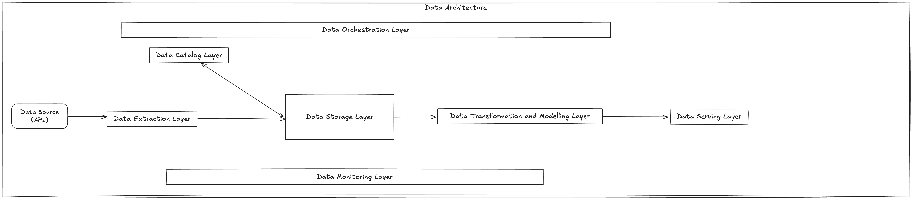

# Overview

This is a project that will experiement the different aspects of the model data stack. We will start from the basic and slowly build up the platform by testing different tools, architectures and methodologies. At the end, we will have a platform that collects women football data from different leagues and makes it accessible for other to analyse and create interesting stories with the data. The tools used will all be open source.

## Architecture

The platform will that the following layers:

* Data Extraction Layer
* Data Catalog Layer
* Data Storage Layer
* Data Transformation and Modelling Layer
* Data Serving Layer
* Data Orchestration Layer
* Data Monitoring Layer

Below is a base design that we will start with then we will build it up as we go.

## Project layout

    mkdocs.yml    # The configuration file.
    docs/
        index.md  # The documentation homepage.
        ...       # Other markdown pages, images and other files.

