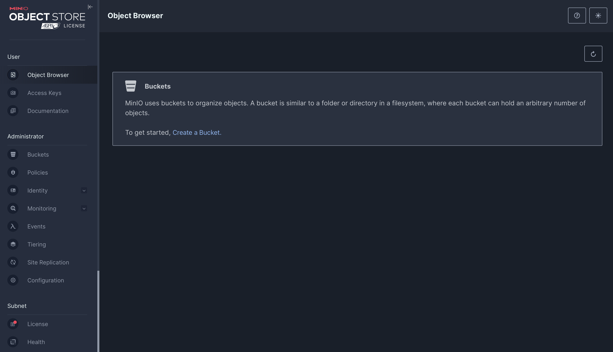
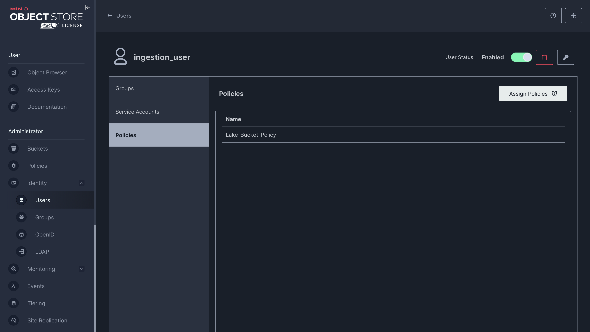

# Data Lake

We will use an object storage as the data lake. This will enable us to have both structured and unstructured data. In addition to this, object storage is cheaper compared to the other storage solutions.

On local deployment, we will use Minio and delpoy it on docker. We will start with a single-node deployment then when we advance, we will also explore a multi-node deployment.

## Deploying Minio

### Step 1: Install Docker and Docker Compose

Install docker desktop following instructions on this [link](https://docs.docker.com/compose/install/)
To confirm docker is installed, run `docker --version`
To confirm docker-compose is installed, run `docker-compose --version`

### Step 2: Create `docker-compose.yml` file

For this project, we will use one docker-compose.yml file for all services.

### Step 3: Add Minio Service to `docker-compose.yml` file

A sample of the service details is in the `docker-compose.yml` file. The enviornment variables are stored in the .env file. You can find a template in `.env.template`. Make sure to change the variable details.

### Step 4: Run docker-compose

Run `docker-compose up -d`

### Step 5: Access Minio Server

To access the webserver, use (127.0.0.1:9001). The username is the value used for `MINIO_ROOT_USER` and Passowrd the value used for `MINI_ROOT_PASSWORD`

When you login, you should see this page:


### Step 6: Create Bucket
The data that will be ingested will be stored in this bucket. The user to be created will be assigned policies that will be specific to this bucket.

### Step 7: Create User

This user will be used by applications to insert data to minio. This is more secure that using the Root User. In the navigation bar identity -> User

### Step 8: Create Policy

We will create a policy that the user will be assigned. We would like the user to be able to add, delete and retrieve objects in the bucket. This is a sample of a policy

```
{
    "Version": "2012-10-17",
    "Statement": [
        {
            "Effect": "Allow",
            "Action": [
                "s3:ListBucket",
                "s3:PutObject",
                "s3:CreateBucket",
                "s3:DeleteObject",
                "s3:GetBucketLocation",
                "s3:GetObject",
                "s3:ListAllMyBuckets"
            ],
            "Resource": [
                "arn:aws:s3:::lake*"
            ]
        }
    ]
}
```
### Step 9: Assign User the policy
Under the identity -> User, select the user that you have created. Under policies, there is a button named Assign Policies. Click on it and the policy that you created will be listed. Select it and save.



### Step 10: Create Access Key for the User created
Still under User, you will see service account. Click on it and you will see access key and password generated. Copy them and save them somewhere safe since you will you it later.


Now Minio is ready to receive data.